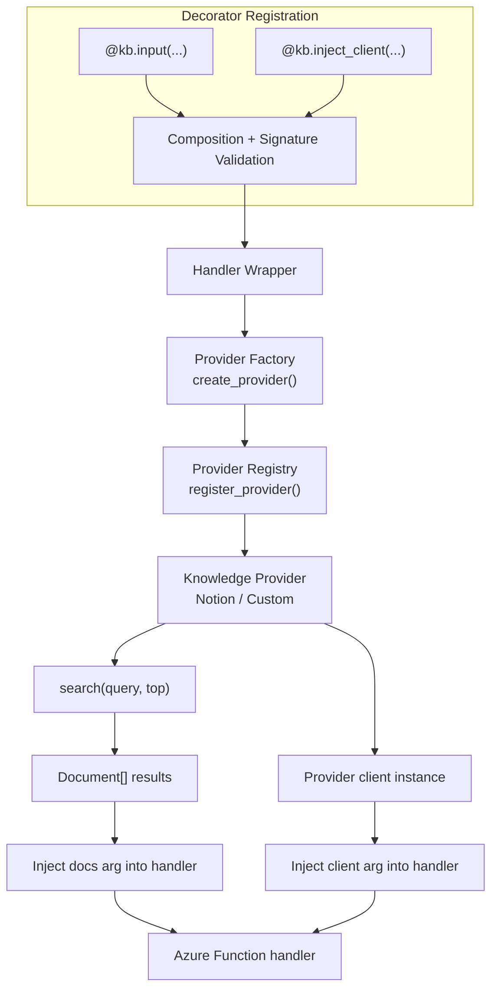

# DESIGN.md

Design Principles for `azure-functions-knowledge-python`

## Purpose

This document defines the architectural boundaries and design principles of the project.

## Design Goals

- Provide decorator-first knowledge retrieval integration for Azure Functions Python v2 handlers.
- Keep handler signatures explicit while enabling injected `Document` results or provider clients.
- Support pluggable providers through a protocol-based provider registry and factory.
- Resolve credentials safely through `%VAR%` placeholder substitution without embedding secrets in code.
- Preserve Azure Functions runtime behavior instead of introducing a competing framework abstraction.

## Non-Goals

This project does not aim to:

- Replace Azure Functions routing, trigger binding, or hosting behavior
- Implement vector indexing, embedding pipelines, or document ingestion workflows
- Own LLM orchestration, prompt pipelines, or agent runtime concerns
- Lock users to a single provider implementation
- Support the legacy `function.json`-based Python v1 programming model

## Design Principles

- Decorators collect and inject data without changing the core execution model of the handler.
- Provider integration happens behind a stable `KnowledgeProvider` protocol boundary.
- Connection values are resolved at runtime from environment variables, not hardcoded credentials.
- Composition rules are enforced early (import-time/decorator-time) with explicit errors.
- Public API changes are conservative because the package is alpha and still establishing stable contracts.

## Architecture

### Core Mechanism: Decorator Registration + Provider Factory + Runtime Injection

The architecture separates declarative decorator configuration from runtime provider execution.
`KnowledgeBindings.input()` and `KnowledgeBindings.inject_client()` validate composition and
signature rules, then create wrappers that call `create_provider()` with resolved connection values.
Providers return `Document` objects or provider clients, and wrappers inject those values into the
handler call path.

## Integration Boundaries

- API schema generation and Swagger UI belong to `azure-functions-openapi-python`.
- Request/response validation belongs to `azure-functions-validation-python`.
- This repository owns RAG-focused decorator wiring, provider abstraction, and `Document` injection.

## Compatibility Policy

- Minimum supported Python version: `3.10`
- Supported Python range: `>=3.10,<3.15`
- Supported runtime target: Azure Functions Python v2 programming model
- Development status: Alpha (`Development Status :: 3 - Alpha`)

## Change Discipline

- Changes to decorator composition rules require regression coverage.
- Changes to `Document` shape or provider protocol are treated as user-facing contract changes.
- Provider-specific behavior changes (for example, Notion search/retrieval mapping) must include tests.
- Experimental provider integrations must be clearly documented as alpha surface area.

## Sources

- [Azure Functions Python developer reference](https://learn.microsoft.com/en-us/azure/azure-functions/functions-reference-python)
- [Azure Functions HTTP trigger](https://learn.microsoft.com/en-us/azure/azure-functions/functions-bindings-http-webhook-trigger)
- [Notion API reference](https://developers.notion.com/reference/intro)

## See Also

- [azure-functions-openapi-python — Architecture](https://github.com/yeongseon/azure-functions-openapi-python) — OpenAPI generation and Swagger UI
- [azure-functions-validation-python — Architecture](https://github.com/yeongseon/azure-functions-validation-python) — Request/response validation pipeline
- [azure-functions-logging-python — Architecture](https://github.com/yeongseon/azure-functions-logging-python) — Structured logging with contextvars
- [azure-functions-doctor-python — Architecture](https://github.com/yeongseon/azure-functions-doctor-python) — Pre-deploy diagnostic CLI
